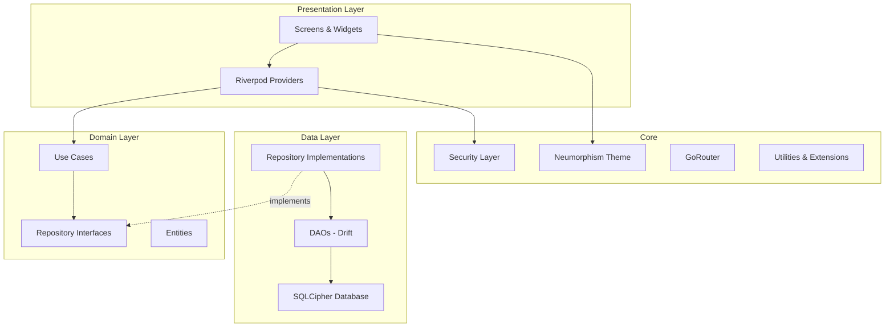
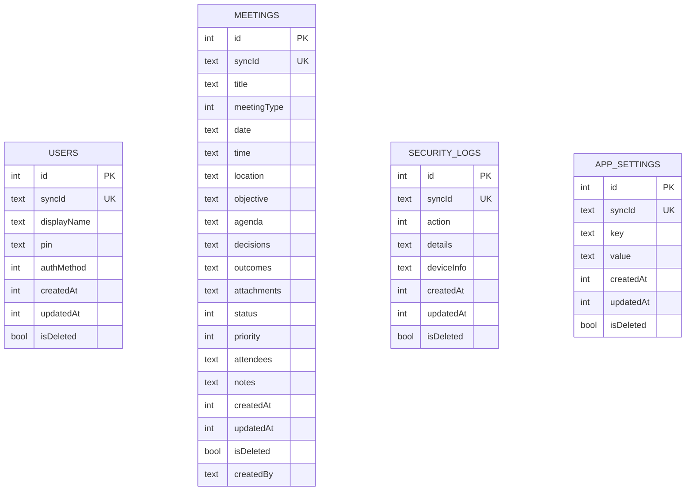

# Mudiri — Phase 1 Implementation Plan

> **مديري** — نظام إدارة تنفيذي احترافي يعمل بدون إنترنت

## Executive Summary

Build the foundational infrastructure and first two feature modules of a production-grade, offline-first executive management system targeting CEOs, executive managers, and secretaries. Phase 1 delivers a fully functional app with **Auth, Security, Theme System, Dashboard, and Meetings**.

---

## Architecture Overview



---

## User Review Required

> [!IMPORTANT]
> **Database ORM**: The plan specifies `Drift` + `SQLCipher` via `drift` + `sqlite3_flutter_libs` + `sqlcipher_flutter_libs`. This is the most robust offline-first approach. Confirm this is acceptable.

> [!IMPORTANT]
> **Navigation**: Using `go_router` for declarative, type-safe navigation with auth guards. Confirm approval.

> [!WARNING]
> **Phase 1 Scope**: Phase 1 includes Auth + Security + Theme + Dashboard + Meetings only. Tasks, Follow-ups, and other modules are deferred to Phase 2+. This keeps the initial delivery focused and shippable.

---

## Open Questions

> [!IMPORTANT]
> 1. **App Icon & Branding**: Do you have a logo/icon for Mudiri, or should I generate one?
> 2. **Package Name**: Suggested `com.mudiri.app` — confirm or provide alternative.
> 3. **Min Android SDK**: Recommend API 23 (Android 6.0) for biometric support. Acceptable?
> 4. **Localization Strategy**: Arabic-only for Phase 1, or should English be a secondary language from the start?
> 5. **Meeting Types**: The plan mentions meeting types — do you have a fixed list, or should these be user-configurable?

---

## Proposed Changes

### Phase 1 Build Order

```
Step 1 → Project Scaffolding & Dependencies
Step 2 → Core: Database Layer (Drift + SQLCipher)
Step 3 → Core: Security Infrastructure  
Step 4 → Core: Executive Neumorphism Theme System
Step 5 → Core: Router + Navigation Shell
Step 6 → Feature: Auth (Biometric + PIN)
Step 7 → Feature: Dashboard
Step 8 → Feature: Meetings
```

---

### Step 1 — Project Scaffolding & Dependencies

#### [NEW] Flutter Project Initialization

```
flutter create --org com.mudiri --project-name mudiri .
```

#### [NEW] [pubspec.yaml](file:///f:/تطبيق%20مديري/pubspec.yaml)

Key dependencies:

| Category | Package | Purpose |
|----------|---------|---------|
| **State** | `flutter_riverpod` | State management |
| **Database** | `drift`, `sqlite3_flutter_libs` | ORM + SQLite |
| **Encryption** | `sqlcipher_flutter_libs` | Database encryption |
| **Security** | `flutter_secure_storage` | Keychain/Keystore |
| **Auth** | `local_auth` | Biometric authentication |
| **Router** | `go_router` | Declarative navigation |
| **UI** | `google_fonts` | Tajawal & IBM Plex Sans Arabic |
| **Utils** | `uuid`, `intl`, `path_provider` | Core utilities |
| **Protection** | `flutter_windowmanager` | Screenshot protection |
| **Code Gen** | `drift_dev`, `build_runner` | Drift code generation |

---

### Step 2 — Core: Database Layer

#### Database Schema (Phase 1 Tables)



#### Files to Create

#### [NEW] `lib/core/database/app_database.dart`
- Main Drift database class with SQLCipher encryption
- Includes all table references and DAOs
- Migration strategy support

#### [NEW] `lib/core/database/tables/base_table.dart`
- Mixin providing `id`, `syncId`, `createdAt`, `updatedAt`, `isDeleted`, `createdBy`
- All tables extend this mixin

#### [NEW] `lib/core/database/tables/users_table.dart`
- User profile and auth preferences

#### [NEW] `lib/core/database/tables/meetings_table.dart`
- Full meeting model with all fields from Plan.md

#### [NEW] `lib/core/database/tables/security_logs_table.dart`
- Immutable security audit log

#### [NEW] `lib/core/database/tables/app_settings_table.dart`
- Key-value settings store

#### [NEW] `lib/core/database/dao/users_dao.dart`
#### [NEW] `lib/core/database/dao/meetings_dao.dart`
#### [NEW] `lib/core/database/dao/security_logs_dao.dart`
#### [NEW] `lib/core/database/dao/app_settings_dao.dart`

#### [NEW] `lib/core/database/migrations/migration_v1.dart`

---

### Step 3 — Core: Security Infrastructure

#### 4-Layer Security Architecture

```
Layer 1: App Entry      → Biometric + PIN authentication
Layer 2: Data Storage   → SQLCipher encrypted database  
Layer 3: UI Protection  → Screenshot blocking, secure fields
Layer 4: Export Safety   → AES-256 encrypted backups
```

#### Files to Create

#### [NEW] `lib/core/security/auth_service.dart`
- Biometric detection and authentication
- PIN validation with secure hashing
- Lock policy enforcement (60s timeout, 5 max attempts, 10min lockout)

#### [NEW] `lib/core/security/encryption_service.dart`
- AES-256 encryption/decryption
- PBKDF2 key derivation
- Secure random key generation

#### [NEW] `lib/core/security/secure_storage_service.dart`
- Flutter Secure Storage wrapper
- Database key management
- Credential storage

#### [NEW] `lib/core/security/lock_manager.dart`
- Auto-lock timer management
- App lifecycle lock triggers
- Background/foreground state handling

#### [NEW] `lib/core/security/security_logger.dart`
- Append-only security log
- Action enum: login, failedLogin, exportData, deleteRecord, etc.
- Device info capture

#### [NEW] `lib/core/security/screenshot_protector.dart`
- FLAG_SECURE management
- Per-screen and global protection

---

### Step 4 — Core: Executive Neumorphism Theme System

#### Design System Specification

| Token | Light | Dark |
|-------|-------|------|
| `bgColor` | `#E8EDF2` | `#1E2530` |
| `shadowDark` | `#C8CDD8` | `#161C26` |
| `shadowLight` | `#FFFFFF` | `#2A3444` |
| `surface` | `#EEF2F7` | `#242D3A` |
| `navyDeep` | `#1E3A5F` | `#1E3A5F` |
| `goldAccent` | `#D4A373` | `#D4A373` |
| `success` | `#2E8B57` | `#2E8B57` |
| `warning` | `#F4A261` | `#F4A261` |
| `danger` | `#D62828` | `#D62828` |

#### Neumorphism Components

| Component | Decoration | Details |
|-----------|------------|---------|
| Dashboard Card | `neuFlat(24)` | Gold top border 3px |
| Meeting Card | `neuFlat(20)` | Status color left bar 5px |
| Input Field | `neuConcave(16)` | Floating label |
| Primary Button | `neuFlat → neuPressed` | 150ms animation |
| Bottom Nav | `neuFlat(0)` | Selected = neuPressed |
| FAB | `neuFlat(50)` | Gold icon |
| Stats Widget | `neuFlat(20)` | Large bold navy number |

#### Files to Create

#### [NEW] `lib/core/theme/neu_colors.dart`
- All color constants for Light and Dark themes
- Status colors, priority colors
- Semantic color getters

#### [NEW] `lib/core/theme/neu_decorations.dart`
- `neuFlat()`, `neuPressed()`, `neuConcave()` BoxDecorations
- Dark mode variants
- Animation curves and durations

#### [NEW] `lib/core/theme/app_typography.dart`
- Tajawal for body text
- IBM Plex Sans Arabic for headings
- Text styles: h1, h2, h3, body, caption, label, button
- RTL-optimized line heights

#### [NEW] `lib/core/theme/app_theme.dart`
- Material 3 ThemeData for Light and Dark
- ColorScheme integration
- Component themes (AppBar, Card, Button, Input, BottomNav)

#### [NEW] `lib/core/theme/app_spacing.dart`
- Spacing scale: xs(4), sm(8), md(12), lg(16), xl(20), xxl(24), xxxl(32)
- Padding presets
- Margin presets

#### [NEW] `lib/core/theme/app_radius.dart`
- Border radius constants matching Neumorphism spec

---

### Step 5 — Core: Router + Navigation Shell

#### Navigation Architecture

```
/ (splash) → /auth (lock screen) → /home (shell with bottom nav)
                                      ├── /home/dashboard
                                      ├── /home/meetings
                                      ├── /home/tasks (Phase 2)
                                      ├── /home/followups (Phase 2)
                                      └── /home/more
                                            ├── /settings
                                            └── /security-log

/meetings/create
/meetings/:id
/meetings/:id/edit
```

#### Files to Create

#### [NEW] `lib/core/router/app_router.dart`
- GoRouter configuration with auth redirect
- ShellRoute for bottom navigation
- Route constants

#### [NEW] `lib/core/router/route_names.dart`
- Named route constants

---

### Step 6 — Feature: Auth

#### Feature Structure

```
lib/features/auth/
├── data/
│   └── auth_repository_impl.dart
├── domain/
│   ├── auth_repository.dart (interface)
│   ├── entities/auth_state.dart
│   └── usecases/
│       ├── authenticate_user.dart
│       ├── setup_pin.dart
│       └── check_biometric_availability.dart
├── presentation/
│   ├── lock_screen.dart
│   ├── pin_setup_screen.dart
│   └── pin_input_screen.dart
├── providers/
│   └── auth_providers.dart
├── widgets/
│   ├── pin_keyboard.dart
│   ├── biometric_button.dart
│   └── lock_animation.dart
└── services/
```

#### Key UX Flow

```
App Launch → Splash (1s) → Lock Screen
                              ├── Biometric prompt (auto)
                              ├── PIN input (fallback)
                              └── → Dashboard (on success)

First Launch → Welcome → PIN Setup → Biometric Setup → Dashboard
```

---

### Step 7 — Feature: Dashboard

#### Feature Structure

```
lib/features/dashboard/
├── data/
│   └── dashboard_repository_impl.dart
├── domain/
│   ├── dashboard_repository.dart
│   ├── entities/dashboard_summary.dart
│   └── usecases/
│       ├── get_today_summary.dart
│       └── get_recent_activity.dart
├── presentation/
│   └── dashboard_screen.dart
├── providers/
│   └── dashboard_providers.dart
├── widgets/
│   ├── today_summary_card.dart
│   ├── quick_actions_bar.dart
│   ├── upcoming_meetings_card.dart
│   ├── urgent_tasks_card.dart (placeholder for Phase 2)
│   ├── pending_followups_card.dart (placeholder for Phase 2)
│   ├── stats_overview.dart
│   └── executive_timeline_mini.dart
└── services/
```

#### Dashboard Layout

```
┌─────────────────────────────────┐
│  مرحباً، [الاسم]    🔔  🔍    │  ← Top Bar
├─────────────────────────────────┤
│  ┌────────────────────────────┐ │
│  │  📅 ملخص اليوم            │ │  ← Today Summary Card
│  │  3 اجتماعات · 5 مهام     │ │
│  │  2 متابعة · 1 موعد       │ │
│  └────────────────────────────┘ │
│                                 │
│  ┌──┐  ┌──┐  ┌──┐  ┌──┐      │
│  │📋│  │✅│  │📞│  │📝│      │  ← Quick Actions
│  └──┘  └──┘  └──┘  └──┘      │
│                                 │
│  ┌────────────────────────────┐ │
│  │  الاجتماعات القادمة       │ │  ← Upcoming Meetings
│  │  ● إدارة المشاريع 10:00  │ │
│  │  ● مراجعة الأداء 14:30   │ │
│  └────────────────────────────┘ │
│                                 │
│  ┌──────┐ ┌──────┐ ┌──────┐   │
│  │ 12   │ │ 85%  │ │  3   │   │  ← Stats Overview
│  │اجتماع│ │إنجاز │ │متأخرة│   │
│  └──────┘ └──────┘ └──────┘   │
│                                 │
│  ┌────────────────────────────┐ │
│  │  النشاط الأخير            │ │  ← Timeline Mini
│  │  ─── اجتماع إدارة ───     │ │
│  │  ─── مهمة: تقرير ───      │ │
│  └────────────────────────────┘ │
│                                 │
├─────────────────────────────────┤
│  🏠   📋   ✅   🔄   ⋯       │  ← Bottom Nav
└─────────────────────────────────┘
```

---

### Step 8 — Feature: Meetings

#### Feature Structure

```
lib/features/meetings/
├── data/
│   └── meetings_repository_impl.dart
├── domain/
│   ├── meetings_repository.dart (interface)
│   ├── entities/
│   │   ├── meeting.dart
│   │   ├── meeting_status.dart
│   │   └── meeting_type.dart
│   └── usecases/
│       ├── create_meeting.dart
│       ├── update_meeting.dart
│       ├── delete_meeting.dart (soft)
│       ├── get_meetings.dart
│       ├── get_meeting_by_id.dart
│       ├── get_today_meetings.dart
│       └── search_meetings.dart
├── presentation/
│   ├── meetings_list_screen.dart
│   ├── meeting_detail_screen.dart
│   ├── create_meeting_screen.dart
│   └── edit_meeting_screen.dart
├── providers/
│   └── meetings_providers.dart
├── widgets/
│   ├── meeting_card.dart
│   ├── meeting_status_badge.dart
│   ├── meeting_type_selector.dart
│   ├── attendees_selector.dart
│   ├── agenda_builder.dart
│   ├── decisions_list.dart
│   ├── outcomes_section.dart
│   └── meeting_filter_bar.dart
└── services/
```

#### Meeting Statuses

| Arabic | English | Color |
|--------|---------|-------|
| مجدول | Scheduled | `info` |
| قيد التنفيذ | In Progress | `warning` |
| مكتمل | Completed | `success` |
| مؤجل | Postponed | `warning` |
| ملغي | Cancelled | `danger` |

#### Meeting UX Flow (≤ 3 Clicks)

```
Dashboard → "اجتماع جديد" Quick Action → Create Meeting Form
Meetings Tab → Meeting Card tap → Meeting Detail (full info)
Meeting Detail → "تعديل" → Edit Form
Meeting Detail → "إنشاء مهمة" → (Phase 2: Task from meeting)
```

---

### Shared Widgets

#### [NEW] `lib/shared/widgets/neu_card.dart`
- Neumorphic card with flat/pressed states
- Gold accent border option
- Status color left bar option

#### [NEW] `lib/shared/widgets/neu_button.dart`
- Primary, secondary, danger variants
- Animated press effect (150ms)
- Loading state with spinner

#### [NEW] `lib/shared/widgets/neu_input.dart`
- Concave neumorphic text field
- Floating Arabic label
- Validation states
- RTL-optimized

#### [NEW] `lib/shared/widgets/neu_bottom_nav.dart`
- 5-tab navigation
- Neumorphic selected state
- Arabic labels

#### [NEW] `lib/shared/widgets/status_badge.dart`
- Color-coded status indicator
- Shared across all features

#### [NEW] `lib/shared/widgets/priority_chip.dart`
- Priority level indicator (urgent, high, medium, low)

#### [NEW] `lib/shared/widgets/app_scaffold.dart`
- Base scaffold with RTL, theme, safe area

#### [NEW] `lib/shared/widgets/empty_state.dart`
- Illustrated empty state for lists

#### [NEW] `lib/shared/widgets/loading_shimmer.dart`
- Neumorphic skeleton loading animation

#### [NEW] `lib/shared/extensions/date_extensions.dart`
- Arabic date formatting
- Hijri date support (future)
- Relative time ("منذ ساعتين")

#### [NEW] `lib/shared/extensions/context_extensions.dart`
- Theme shortcuts
- Navigator shortcuts
- Responsive breakpoints

---

### App Entry Point

#### [NEW] `lib/main.dart`
- ProviderScope wrapper
- Security initialization
- Database initialization
- Theme application

#### [NEW] `lib/app.dart`
- MaterialApp.router with GoRouter
- Arabic locale configuration
- RTL directionality
- Theme toggling support

---

## Complete File Manifest (Phase 1)

```
lib/
├── main.dart
├── app.dart
│
├── core/
│   ├── database/
│   │   ├── app_database.dart
│   │   ├── app_database.g.dart (generated)
│   │   ├── tables/
│   │   │   ├── base_table.dart
│   │   │   ├── users_table.dart
│   │   │   ├── meetings_table.dart
│   │   │   ├── security_logs_table.dart
│   │   │   └── app_settings_table.dart
│   │   ├── dao/
│   │   │   ├── users_dao.dart
│   │   │   ├── meetings_dao.dart
│   │   │   ├── security_logs_dao.dart
│   │   │   └── app_settings_dao.dart
│   │   └── migrations/
│   │       └── migration_v1.dart
│   │
│   ├── security/
│   │   ├── auth_service.dart
│   │   ├── encryption_service.dart
│   │   ├── secure_storage_service.dart
│   │   ├── lock_manager.dart
│   │   ├── security_logger.dart
│   │   └── screenshot_protector.dart
│   │
│   ├── theme/
│   │   ├── neu_colors.dart
│   │   ├── neu_decorations.dart
│   │   ├── app_typography.dart
│   │   ├── app_theme.dart
│   │   ├── app_spacing.dart
│   │   └── app_radius.dart
│   │
│   ├── router/
│   │   ├── app_router.dart
│   │   └── route_names.dart
│   │
│   ├── constants/
│   │   ├── app_constants.dart
│   │   └── enums.dart
│   │
│   └── utils/
│       ├── date_utils.dart
│       └── validators.dart
│
├── features/
│   ├── auth/
│   │   ├── data/
│   │   │   └── auth_repository_impl.dart
│   │   ├── domain/
│   │   │   ├── auth_repository.dart
│   │   │   ├── entities/
│   │   │   │   └── auth_state.dart
│   │   │   └── usecases/
│   │   │       ├── authenticate_user.dart
│   │   │       ├── setup_pin.dart
│   │   │       └── check_biometric_availability.dart
│   │   ├── presentation/
│   │   │   ├── splash_screen.dart
│   │   │   ├── lock_screen.dart
│   │   │   ├── pin_setup_screen.dart
│   │   │   └── pin_input_screen.dart
│   │   ├── providers/
│   │   │   └── auth_providers.dart
│   │   └── widgets/
│   │       ├── pin_keyboard.dart
│   │       ├── biometric_button.dart
│   │       └── lock_animation.dart
│   │
│   ├── dashboard/
│   │   ├── data/
│   │   │   └── dashboard_repository_impl.dart
│   │   ├── domain/
│   │   │   ├── dashboard_repository.dart
│   │   │   ├── entities/
│   │   │   │   └── dashboard_summary.dart
│   │   │   └── usecases/
│   │   │       ├── get_today_summary.dart
│   │   │       └── get_recent_activity.dart
│   │   ├── presentation/
│   │   │   └── dashboard_screen.dart
│   │   ├── providers/
│   │   │   └── dashboard_providers.dart
│   │   └── widgets/
│   │       ├── today_summary_card.dart
│   │       ├── quick_actions_bar.dart
│   │       ├── upcoming_meetings_card.dart
│   │       ├── urgent_tasks_card.dart
│   │       ├── pending_followups_card.dart
│   │       ├── stats_overview.dart
│   │       └── executive_timeline_mini.dart
│   │
│   └── meetings/
│       ├── data/
│       │   └── meetings_repository_impl.dart
│       ├── domain/
│       │   ├── meetings_repository.dart
│       │   ├── entities/
│       │   │   ├── meeting.dart
│       │   │   ├── meeting_status.dart
│       │   │   └── meeting_type.dart
│       │   └── usecases/
│       │       ├── create_meeting.dart
│       │       ├── update_meeting.dart
│       │       ├── delete_meeting.dart
│       │       ├── get_meetings.dart
│       │       ├── get_meeting_by_id.dart
│       │       ├── get_today_meetings.dart
│       │       └── search_meetings.dart
│       ├── presentation/
│       │   ├── meetings_list_screen.dart
│       │   ├── meeting_detail_screen.dart
│       │   ├── create_meeting_screen.dart
│       │   └── edit_meeting_screen.dart
│       ├── providers/
│       │   └── meetings_providers.dart
│       └── widgets/
│           ├── meeting_card.dart
│           ├── meeting_status_badge.dart
│           ├── meeting_type_selector.dart
│           ├── attendees_selector.dart
│           ├── agenda_builder.dart
│           ├── decisions_list.dart
│           ├── outcomes_section.dart
│           └── meeting_filter_bar.dart
│
└── shared/
    ├── widgets/
    │   ├── neu_card.dart
    │   ├── neu_button.dart
    │   ├── neu_input.dart
    │   ├── neu_bottom_nav.dart
    │   ├── status_badge.dart
    │   ├── priority_chip.dart
    │   ├── app_scaffold.dart
    │   ├── empty_state.dart
    │   └── loading_shimmer.dart
    └── extensions/
        ├── date_extensions.dart
        └── context_extensions.dart
```

**Total files: ~75 Dart files** (including generated code)

---

## Key Technical Decisions

| Decision | Choice | Rationale |
|----------|--------|-----------|
| ORM | Drift | Type-safe, code-gen, migration support, SQLCipher compatible |
| Encryption | SQLCipher + AES-256 | Military-grade DB encryption + export encryption |
| State Mgmt | Riverpod (AsyncNotifier) | Modern, testable, compile-safe |
| Navigation | go_router | Declarative, auth guards, deep linking |
| Design System | Executive Neumorphism | Lightweight Soft UI, optimized for mid-range devices |
| Fonts | Tajawal + IBM Plex Sans Arabic | Professional Arabic typography |
| Soft Delete | All tables | Sync-ready, data recovery |
| Timestamps | Unix int (ms) | Efficient storage, timezone-agnostic |
| IDs | Auto-increment + UUID syncId | Local performance + future sync |

---

## Verification Plan

### Build Verification
```bash
flutter analyze    # Zero errors, zero warnings
flutter build apk  # Successful APK generation
```

### Automated Tests (Phase 1)
- Unit tests for all Use Cases
- Unit tests for DAOs (in-memory database)
- Unit tests for security services
- Widget tests for shared components
- Widget tests for auth flow
- Integration test: Full auth → dashboard → meetings flow

### Manual Verification
- RTL layout validation on all screens
- Neumorphism visual consistency audit
- Biometric auth flow on physical device
- PIN setup and lockout behavior
- Screenshot protection verification
- Database encryption verification (inspect .db file)
- Performance profiling on mid-range device

### Checklist Before Phase 1 Completion
- [ ] All screens render correctly in RTL
- [ ] Neumorphism design system applied consistently
- [ ] Biometric and PIN auth working
- [ ] Auto-lock functioning after 60s
- [ ] Screenshot protection active
- [ ] Database encrypted with SQLCipher
- [ ] Meetings CRUD fully operational
- [ ] Dashboard showing real data
- [ ] Soft delete working
- [ ] Security log recording events
- [ ] No hardcoded strings
- [ ] All widgets under 300 lines
- [ ] Performance acceptable on mid-range device

---

## Estimated Effort

| Step | Description | Est. Files |
|------|-------------|------------|
| 1 | Project Scaffolding | 2 |
| 2 | Database Layer | 12 |
| 3 | Security Infrastructure | 6 |
| 4 | Theme System | 6 |
| 5 | Router + Navigation | 2 |
| 6 | Auth Feature | 11 |
| 7 | Dashboard Feature | 10 |
| 8 | Meetings Feature | 16 |
| - | Shared Widgets | 11 |
| **Total** | | **~76 files** |
